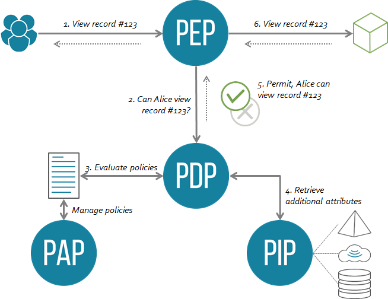

---
stand_alone: true
ipr: none
cat: std # Check
submissiontype: IETF
wg: OpenID AuthZEN

docname: AuthorizationDesignPatterns

title: Authorization Design Patterns
abbrev: azpatt
lang: en
kw:
- Authorization
- Access Management
- Design Pattern
- PDP
- PEP

author:
- role: editor # remove if not true
  ins: A. Babeanu
  name: Alexandre Babeanu
  org: 3Edges
  email: alex@3edges.com
  contributor: # Same structure as author list, but goes into contributors
- name: Gerry Gebel
  org: Strata
  email:
- name: Omri Gazitt
  org: Aserto
  email: omri@aserto.com
- name: Pieter Kasselman 
  org: Microsoft
  email:

--- abstract

There are several possible architectures and design patterns for authorization systems. This document details the following patterns: traditional PEP/PDP, Provisioning, External API, User Journeys, Microservices and Authorization Mesh. It details how and when to use each of the patterns. This document is expected to guide the authorization system implementers and integrators, as well as suggest the best possible authorization model to use for each pattern.

--- middle

# Authorization Design Patterns

# Background

Authorization is a hard problem, everybody seems to agree. This document introduces the concept of "Authorization Design patterns”, a list of the various common architectures typically found in authorization systems. The purpose of these patterns is to provide ways for practitioners to make sense of these complexities, and tools to overcome them. This document thus tries to provide an exhaustive catalogue of such patterns, similar to what exists in the software development world (see for example: [https://refactoring.guru/design-patterns](https://refactoring.guru/design-patterns) ).

# Contents

[TOC]

# Introduction

The “authorization problem” stems from 4 main factors:

1. The sheer complexity of environments found in the industry. Organisations of all verticals use many heterogeneous systems to run their businesses. They have many types of resources to protect, in many environments (cloud or not), including legacy systems, web services and IoT devices. It is hard, or impossible, to find a system that can cater to all use-cases. 
2. The sheer amount of data that organisations need to process nowadays puts a new strain on traditional tools. In the age of Web3, Data Meshes and Data Lakes, proper access control to data at scale is a real concern.
3. Access policy requirements become increasingly complex in a more and more interconnected world. Authorization systems must go well beyond the traditional tools and methodologies supported so far in order to meet these new complexities. For example: data sharing in joint ventures.
4. Finally, it is hard to convince teams and organisations to change the way they’ve always solved the authorization problem: by using home-grown custom code in their systems. This is, arguably, the hardest problem of all. Proper tooling, messaging and training needs to be developed to ease the transition of these teams to more modern methods.

By building a catalogue of Authorization Design Patterns, we provide the beginnings of the answers needed to solve these four problems; i.e.,

* We recognize that different systems require different authorization models;
* We recognize that new technology is needed to handle the explosion of data we witness worldwide nowadays;
* We recognize the need for new Authorization models, able to express any current complex access rules in this new environment;
* Through these patterns, we provide ways by which organisations can start externalising their authorizations in order to reap the benefits of external central policy stores.

# What are Authorization Design Patterns?

Patterns for Authorization Design (**PAD**) are typical solutions to commonly occurring problems in Authorization. PADs also encapsulate best practices for authorization. 

When referring to authorization specifically, these patterns are of 2 types:

* **Architectural patterns**: they provide a high level architecture and/or topology of the various components involved in the authorization systems. 
* **Model patterns**: These are patterns that suggest the use of the most appropriate authorization methodology for any given type of access rule. In other words, when is it best to use RBAC, ABAC, FGA, etc...?

Authorization standards have typically involved both architecture and methodology requirements. If a lot of literature has so far been dedicated to the various authorization methodologies and their comparison, little has been said about authorization system architecture, aside from the (now traditional):  `PEP → PDP →…`   data flowcharts.

Nevertheless, as we will see, “PEP” means different things in the various patterns below… In any case, this document focuses on the architectural patterns.

# Patterns for Authorization Design

Choosing the right PAD for any given requirement is generally mainly dependent on the resource(s) to protect, but may also depend on the environment and other factors. Thus, it is expected that organisations will need to implement several of these patterns and use them in conjunction.

## Traditional PEP

### Description

This is the traditional Policy-Enforcement-Point / Policy-Decision-Point model described in the XACML standard in 2003, and still the de-facto current standard for authorization.

Traditional ABAC architecture

[ABAC Architecture]: https://py-abac.readthedocs.io/en/latest/concepts.html "ABAC Architecture"
[RFC-2753]: https://datatracker.ietf.org/doc/html/rfc2753 "RFC 2753"

(Source: [ABAC Architecture], see also [RFC-2753] )

In this traditional model, the Policy Enforcement Point (PEP)  “ is a component at a network node and PDP is a remote entity that may reside at a policy server.” Even if both PEP and PDP can be colocated, it is understood that they are distinct components.

The PEP component is a proxy-like agent placed in front of the resource to protect and serves as its “authorization firewall”. It captures all requests incoming to the Resource Server, and asks the PDP to decide whether to allow or deny each request. 

The Resource Server/Service/Thing only ever receives the requests that are allowed to go through.

The PEP works here at the protocol level, typically over HTTP (it is basically a reverse-proxy server).

### When to use

* **Traditional/Legacy web apps** or Web Services where the resources are full URLs.
* **IoT Devices**: if the IoT devices don’t have network capabilities, they are generally fronted by smart IoT gateways. Those gateways can act as a PEP in front of the devices they manage.
* **REST APIs**. Particularly well suited for this use case, since each full API URL is a resource.

### When Not to use

* **COTS software** - they have their internal logic, each is different.
* **GraphQL APIs** - this is an anti pattern for GraphQL, and against best practices. Authorization must be at the business logic level.
* **API Gateways** - The API Gateway itself is a proxy. one would therefore not add another proxy (a PEP) in front of it. Instead, the trick here is to make the Gateway itself behave like a PEP - see “External API Call” pattern below. .

### Benefits

* Can be deployed in front of (legacy or new) apps without requiring the apps to change in any way.
* Can be deployed in front of REST APIs without requiring any changes to the APIs.

### Limitations

* Harder to use for modern Single Page Apps (SPAs): in that case, a scheme needs to be devised to identify the requested resources (the Single Page App only has 1 URL for all its resources). This would be a custom (so far) scheme since no standard exists for it.
* Not appropriate if the Access Decision relies on runtime business logic within the resource server (the PDP and resource server are completely separate).

## Provisioning

In this model, the Authorization service changes the security settings of the resources it protects, using that Resource’s own APIs or protocols. This is generally done through Connectors, and typically happens during regular provisioning or deprovisioning processes. This pattern therefore requires a provisioning tool or platform.

### When to use

* **COTS software products** - it’s -so far- the only option to secure off the shelf products such as Salesforce, Tableau, CyberArk, etc… Most COTS do expose an API for modifying their internal security permissions and accesses.
* **Central Permission Stores**, such as LDAP/AD or other databases. In a lot of cases, applications rely on these central stores for their policies.

### When not to use

* **ABAC**: If the authorization requires ABAC rules then provisioning will likely not be adequate. Most COTS and central stores only support some form of RBAC.
* **Any other** types of resources.

### Benefits

* Allows seamless integration with COTs, once implemented.
* Managing the central store (RBAC) policies can be sufficient to manage a lot of dependent apps and systems.
* Can leverage standards for provisioning - e.g., SCIM

### Limitations

* Leads to the “Role Explosion” problem.
* Makes it really hard to handle complexity, such as acquisitions, partnerships, data sharing, big data etc… 

## External API Call (Resource-Enforcer pattern)

In this model, the resource server itself makes API calls to an external Dynamic Authorization system that acts as the PDP. The PEP resides here inside the resource server’s own business logic, and is generally just a code wrapper around this external authorization call. From the PDP standpoint, there’s really no PEP, the resource itself enforces the authz decisions.

This is the most flexible way to integrate external authorization as it can be used by most resource types, including legacy apps.

## When to use

* **Custom / in-house apps**, new and legacy.
* **REST APIs**
* **GraphQL APIs** - the graphQL Best practices require placing authorization within the Business Logic of the application or API. This can generally be achieved using @auth annotations on the GraphQL schema (see also:[https://idpro.org/securing-graphql-apis/](https://idpro.org/securing-graphql-apis/)). This pattern is also likely the only option for GraphQL APIs.
* **Smart IoT devices or gateways** : some IoT devices can make API calls.
* **API Gateways** : probably the only way to integrate with those systems also. As seen above, the trick here is to make the Gateway itself behave like a PEP, or a resource, by issuing Decision requests through the PDP’s API.

*Note*: An API Gateway or any other proxy, will likely only be able to enforce coarse-grained policies, since it can only access the request itself (Method, Body, Access_token). By contrast, the resource service has full understanding of the context of the authorization. It knows what the resource context is (could be in the URL, could be inside the body, or may need to be retrieved from the resource service itself using a request parameter as a key).

### When not to use

* **COTs** (unless they allow custom external API calls).

### Benefits

* It’s the Jack-of-all-trades pattern, it can cater to the most types of resources and environments.
* Provides ways to integrate with any external authorization platform, any existing methodology is available.
* Future-proofs the resources, since future enhancements/inventions can still be integrated.
* Simpler deployments (no external PEP).

### Limitations

* Requires code changes to legacy/older apps.
* Potentially more latency, which can be reduced by placing the PDP near the resource to protect.

## User journeys

In some cases, access to certain security-sensitive resources require higher levels of assurance and hence additional authentication factors. In those cases, some level authorization needs to be performed at the time of user authentication, through an orchestration process. The selection of the authentication factors to use can thus depend on the resource being accessed, as well as other adaptive factors.

### When to use

* When accessing sensitive COTS or Apps that require higher levels of Authentication Assurance.
* Any other case where orchestration is required during identity authentication.
* Can be used for any type of resources, in combination with the other patterns described here.
* The orchestration pattern can leverage the [OAuth2 Step Up Authentication Challenge Protocol](https://datatracker.ietf.org/doc/rfc9470/), which may make this orchestration easier to support. 

### When not to use

When orchestration is not needed during login/authentication.

### Limitation

Generally requires 2 authorizations. 

Given that a first authorization happens here at the IdP level, during authentication, a 2nd authorization process is likely necessary in the Resource in order to ensure the subject, once authenticated with the right Assurance Level, can only access the right protected items.

_For Example_, accessing a PAM system may require Authentication Assurance Level 2 or higher; but once authenticated, the subject doesn’t necessarily have access to all the vaults and secrets.

## Microservices

In this particular case, the resources to protect are micro-services that may, or not, be organised in a Mesh. Micro services require a different kind of PEP, one that is small and can be -typically- deployed as a side-car to the resource service Pod (typically a modified Envoy proxy container).

An alternative here is for microservices to issue Dynamic calls to the APIs exposed by an external PDP. 

In both cases, the usages and limitations are the same as the traditional PEP or External API call, as described above. The main difference here is that the nature of the PEP may limit its functionality.

## Authorization Mesh

This pattern is not in use (yet), but it’s an idea for future R&D that has some advantages, in theory at least.

Instead of using API calls between PEP or Resource and PDP, all the traffic between the various components is done through Messages, published through a streaming system. Authorization Events at the Resource or PEP would thus trigger Authorization Request Messages. 

The PDP would then subscribe to the various topics that Resources/PDPs publish to, and compute a decision. Once computed, the PDP would publish response messages to a response topic stream.

PEP/Resources would then subscribe to the response topic and proceed as instructed.

These events could use the Shared Signals Framework specification (SSF - ([https://openid.net/specs/openid-sse-framework-1_0-ID1.html](https://openid.net/specs/openid-sse-framework-1_0-ID1.html) ) for their format.

### When to use

* Could be used in all cases, in particular if/when COTS adopt the SSF.

### Benefits

* This approach completely de-couples PEP, Resource and PDP. As long as they all adhere to the same Event formats, all components can use any methodology, protocol or language as needed. Defining a common Message format is arguably easier than defining a common language or set of API definitions for authorization.
* Allows for much better scaling. One can imagine spinning-up many instances of PDPs to consume large numbers of Authorization messages in parallel, as needed.
* Most organisations that manage large datasets already use Streaming technologies and data meshes, it would not be a stretch for them to add some authorization topics to those. The Authorization Mesh is a kind of Data Mesh.
* There are several free or open-source Streaming platforms, which should help smaller organisations adopt the technology too.

### Notes

* _May_ require a streaming platform (e.g., Apache Kafka)
* Requires some additional conventions/work, in particular to ensure event ordering and tracking authorization requests (i.e., which event to send to which topic).
* Using a tightly coupled architecture like that described in SSF may lead to latency issues and timeouts.

# Conclusion

**Legend**:

➖ : Could be used with extra effort or limitations
✅ : Appropriate to use
❌ : Not Appropriate to use

|-----------------+------------+-----+------------+------+----------+-------------+-----+---------------+----------|
|                 | Legacy App | SPA | Custom App | COTS | REST API | GraphQL API | IoT | Micro Service | API Gtwy |
|-----------------+------------+-----+------------+------+----------+-------------+-----+---------------+----------|
| Traditional PEP |     ✅     | ➖  |     ✅     |  ❌  |    ✅   |      ❌     | ✅  |       ✅      |    ❌    |
|-----------------+------------+-----+------------+------+----------+-------------+-----+---------------+----------|
|  Provisioning   |     ➖*    | ➖* |     ➖*    |  ✅  |    ➖*  |      ➖*    | ❌  |       ➖*     |    ➖*   |
|-----------------+------------+-----+------------+------+----------+-------------+-----+---------------+----------|
|  External API   |     ✅     |  ✅ |     ✅     | ➖** |    ✅   |      ✅     | ✅  |       ✅      |    ✅    |
|-----------------+------------+-----+------------+------+----------+-------------+-----+---------------+----------|
|  User Journey   |     ✅     |  ✅ |     ✅     | ➖** |    ✅   |      ✅     | ✅  |       ✅      |    ✅    |
|-----------------+------------+-----+------------+------+----------+-------------+-----+---------------+----------|

    * :  Use only if provisioning to a central store (e.g., AD/LDAP) that the resource uses.
    ** : Only if the resource supports it
